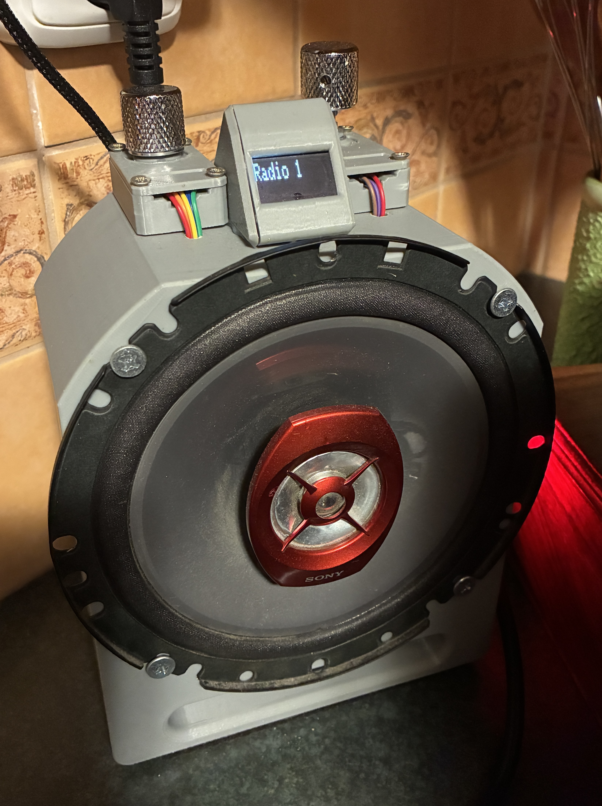

# 📻 ESP32 Internet Radio (OLED + Rotary Encoder + I2S)



This project is an **ESP32-based internet radio** that streams online radio stations over WiFi.
Audio is played via an **I2S DAC (MAX98357A)**, station information is shown on an **SSD1306 OLED display**, stations can be changed using a **rotary encoder**, and volume is controlled with an **analog potentiometer**.
The case is 3D printed.

---

## ✨ Features

- 🌐 WiFi internet radio streaming (MP3)
- 🔊 I2S audio output (MAX98357A)
- 🖥️ 128×32 SSD1306 OLED display (I2C)
- 🔄 Rotary encoder for station selection
- 🎚️ Analog volume control (ADC1)
- 🏷️ Displays station name and stream title
- 🔁 Smoothed volume control using averaging

---

## 🧰 Hardware Requirements

- ESP32 development board
- MAX98357A I2S audio amplifier
- 128×32 SSD1306 OLED display
- Rotary encoder
- Potentiometer (10k recommended)
- Speaker
- Jumper wires

---

## 🔌 Pin Connections

### I2S Audio (MAX98357A)

| MAX98357A | ESP32 GPIO |
|----------|------------|
| DIN      | GPIO14     |
| BCLK     | GPIO12     |
| LRC      | GPIO13     |
| GND      | GND        |
| VIN      | 3.3V / 5V  |

---

### OLED Display (SSD1306 – I2C)

| OLED | ESP32 GPIO |
|-----|------------|
| SDA | GPIO18     |
| SCL | GPIO17     |
| VCC | 3.3V       |
| GND | GND        |

- I2C Address: `0x3C`
- Resolution: `128×32`

---

### Rotary Encoder

| Encoder Pin | ESP32 GPIO |
|------------|------------|
| CLK        | GPIO6      |
| DT         | GPIO7      |
| GND        | GND        |

> ⚠️ **Note:** Make sure GPIO6 and GPIO7 are free on your ESP32 board.

---

### Volume Potentiometer

| Potentiometer | ESP32 GPIO |
|--------------|------------|
| Signal       | GPIO4 (ADC1) |
| VCC          | 3.3V         |
| GND          | GND          |

---

## 📚 Libraries Used

Install the following libraries in **Arduino IDE**:

- ESP32 Arduino Core
- WiFi (built-in)
- **Audio** library by *schreibfaul1* - ONLY WORKS WITH ESP32-S3 !!!!!
- **Adafruit GFX Library**
- **Adafruit SSD1306**

---

## 🚀 Setup & Usage

1. Clone this repository
2. Open the project in **Arduino IDE**
3. Set your WiFi credentials in the source code:
   ```cpp
   const char* ssid = "YOUR_WIFI_SSID";
   const char* password = "YOUR_WIFI_PASSWORD";
   ```
4. Select your ESP32 board and COM port  
5. Upload the code  
6. Power the device and enjoy  

---

## 🎛️ Controls

| Control | Action |
|-------|--------|
| Rotate encoder | Change station |
| Potentiometer | Adjust volume |
| OLED display | Station name & stream title |

---

## 📻 Radio Stations

Preconfigured stations include:

- Radio 1
- Retro Radio
- Petofi Radio
- Slager FM
- Gyor Plusz Radio
- Radio Expres
- Fun Radio
- Radio Jemne
- Europa 2
- Radio Rock
- Radio Vlna

Stations can be edited in the source code:

```cpp
const char* stations[];
const char* stationNames[];
```

## 🧠 How It Works

- ESP32 connects to WiFi
- Streams MP3 audio over HTTP
- Decodes audio in real time
- Outputs sound via I2S DAC
- Displays metadata on OLED
- Uses a rotary encoder state machine
- Smooths volume using ADC averaging

---

## 🛠️ Possible Improvements

- Play / Pause button
- Favorite stations
- NTP clock display
- WiFi signal strength
- Automatic reconnect

---

## 🧪 Notes

- Use ADC1 pins only for volume control
- Some streams do not provide metadata
- OLED resolution limits text size


